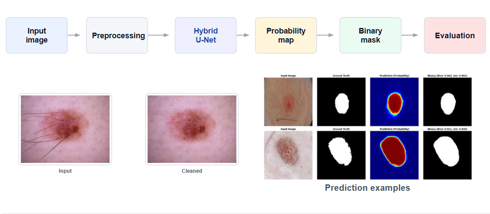
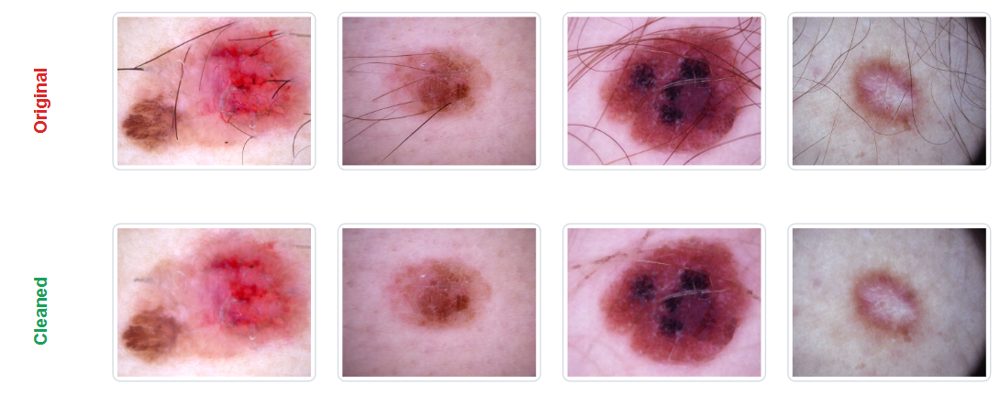
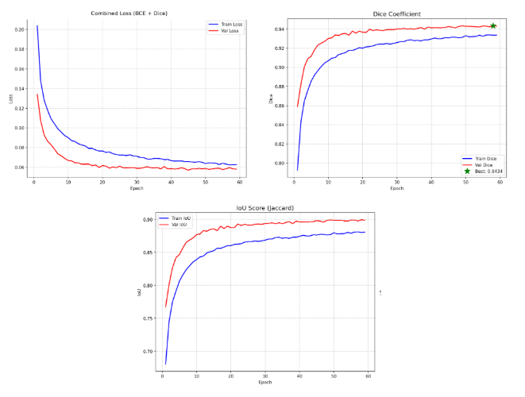

# Skin Lesion Segmentation

[](https://pytorch.org)
[](https://challenge.isic-archive.com/landing/2018/)

Binary skin lesion segmentation on the **ISIC 2018 Challenge – Task 1** dataset using a Hybrid U-Net (ResNet34 + scSE attention). The model produces pixel-level masks separating malignant lesions from healthy skin in dermoscopy images.

**Best result:** Dice **0.9466** | IoU **0.9051** | Std **0.0697**

---

## Pipeline



---

## Results

### Effect of Preprocessing

Artifact removal (hair via **DullRazor**, rulers, bubbles) significantly improves performance:

| Metric | Before | After |
|:---:|:---:|:---:|
| Dice (mean) | 0.9011 | **0.9466** |
| IoU (mean) | 0.8354 | **0.9051** |
| Dice (std) | 0.1159 | **0.0697** |



### Comparison with Baseline Models

All models trained on the same preprocessed dataset under identical conditions:

| Model | Dice (mean) | IoU (mean) | Dice (std) |
|:---|---:|---:|---:|
| U-Net | 0.9274 | 0.8773 | 0.1004 |
| DeepLabV3 | 0.9363 | 0.8873 | 0.0723 |
| DeepLabV3+ | 0.9447 | 0.9021 | 0.0719 |
| SAM 2 (ViT) | 0.9320 | 0.8810 | 0.0950 |
| TransUNet (ViT) | 0.9410 | 0.8960 | 0.0780 |
| **Hybrid U-Net** | **0.9466** | **0.9051** | **0.0697** |



### Comparison with Related Studies

| Paper / Model | IoU | Dice |
|:---|---:|---:|
| Yuan et al. (2018) – ISIC 1st place | 0.802 | ~0.890 |
| RECOD Titans (2018) | 0.728 | ~0.843 |
| Nguyen Tu Anh (2024) | ~0.8796 | 0.9359 |
| **Hybrid U-Net (ours)** | **~0.9051** | **~0.9466** |

*Note: Comparisons are approximate due to different test splits.*

---

## Quick Start

```bash
# Clone
git clone https://github.com/your-org/skin-cancer-detection.git
cd skin-cancer-detection

# Environment
conda env create -f environment.yml
conda activate cv
pip install -e ".[dev]"

# Data preparation (DullRazor hair removal + train/val/test split)
python scripts/prepare_data.py --data-dir path/to/HAM10000 --out-dir data/processed

# Train
python scripts/train.py --config configs/experiments/resnet34_unet_v1.yaml

# Evaluate (with TTA + threshold search)
python scripts/evaluate.py --config configs/experiments/resnet34_unet_v1.yaml \
    --checkpoint outputs/resnet34_unet_v1/best_model.pth

# Predict (3-panel overlay)
python scripts/predict.py --config configs/experiments/resnet34_unet_v1.yaml \
    --input data/processed/test/images/ISIC_0024306.jpg \
    --checkpoint outputs/resnet34_unet_v1/best_model.pth --overlay --tta
```

---

## Project Structure

```
├── configs/          # YAML configs with _base_ inheritance
├── src/
│   ├── data/         # ISICDataset & Albumentations transforms
│   ├── models/       # Model registry (U-Net, DeepLabV3+, TransUNet)
│   ├── losses/       # Focal + Dice loss
│   ├── metrics/      # Dice & IoU (macro-per-sample)
│   ├── training/     # Trainer, callbacks, DDP
│   ├── inference/    # TTA (5-view geometric averaging)
│   └── utils/        # Config, logging, checkpointing
├── scripts/          # train, evaluate, predict, benchmark
└── tests/            # 20+ test files
```

---

## Commands

| Command | Description |
|:---|---|
| `ruff check src/ scripts/ tests/` | Lint |
| `pytest tests/ -v` | Run all tests |
| `python scripts/benchmark_fps.py` | FPS benchmark |
| `python scripts/benchmark_inference.py` | Multi-model inference benchmark |

---

## Citation

```bibtex
@misc{phan2025skin,
  title={Skin Lesion Segmentation Using Hybrid U-Net with scSE Attention},
  author={Phan Tan Tai and Nguyen Thanh Quyen and Nguyen Truong Vuong and Le Trong Ngoc},
  year={2025}
}
```

```bibtex
@inproceedings{isic2018,
  title={Skin Lesion Analysis Toward Melanoma Detection},
  booktitle={ISIC Challenge 2018},
  year={2018}
}
```
